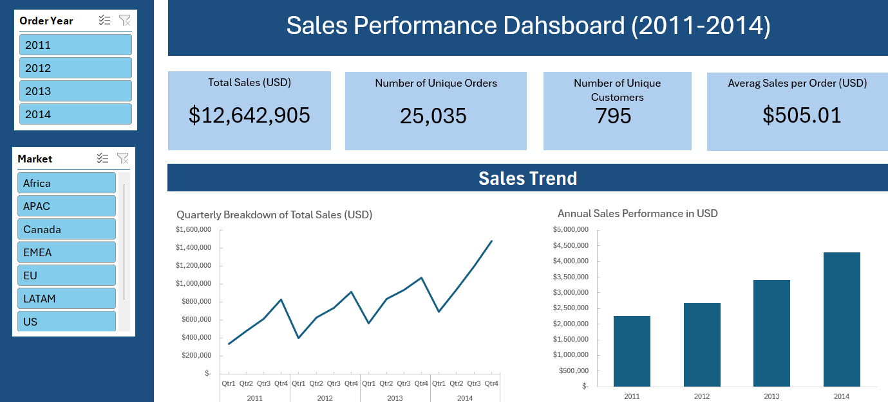
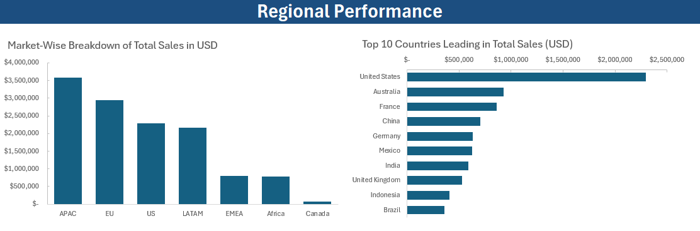
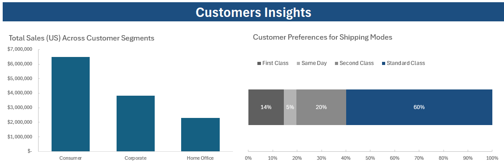
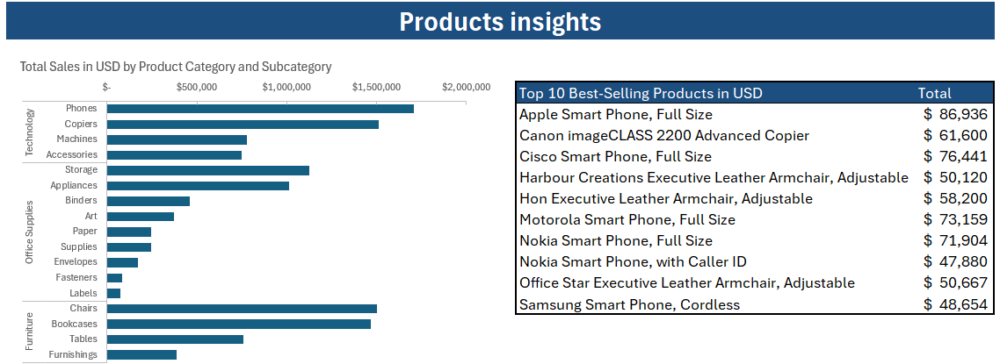

# Superstore Sales Analysis
An Excel-based project analysing sales data to uncover actionable insights and optimise marketing and sales strategies

Image from [storyset](https://storyset.com/search?q=online%20shopping)

> **Note**
>
> This project draws inspiration from Karina Samsonova's data portfolio work featured on her [YouTube channel](https://www.youtube.com/watch?v=U0I3HEnTAWk&ab_channel=KarinaDataScientist). Her comprehensive tutorial on building an interactive Excel dashboard provided exceptional guidance throughout my learning journey. I am profoundly grateful for Karina's expertise and generosity in sharing such valuable educational content.
>
> Original Project:
> 
> Title: Data Analysis Project in Excel - Build Interactive Dashboard. Author: Karina Samsonova Platform: [YouTube](https://www.youtube.com/watch?v=U0I3HEnTAWk&ab_channel=KarinaDataScientist)
>
> This project enhanced my analytical capabilities and expanded my proficiency in data visualisation. Full recognition for the original concept and methodological approach belongs to Karina Samsonova. Her work can be explored further via her [YouTube Channel](https://www.youtube.com/@karinadatascientist) and [LinkedIn](https://www.linkedin.com/in/karina-samsonova/) profile.
 

## Table Of Contents
- [Executive Summary](#executive-summary)
  - [Primary Goal](#primary-goal)
  - [Solution](#solution)
  - [Key Findings](#key-findings)
  - [Recommendations](#recommendations)
- [Introduction](#introduction)
  - [Business Problem](#business-problem)
  - [Goals](#goals)
- [Methodology](#methodology)
  - [Data Source](#data-source)
  - [Tools](#tools)
  - [Data Cleaning and Transformation](#data-cleaning-and-transformation)
  - [Data Analysis](#data-analysis)
  - [Excel Formulae](#excel-formulae)
  - [Data Visualisation](#data-visualisation)
- [Insights](#insights)
- [Action Plan](#action-plan)	 
- [Excel Report](#excel-report)	

## Executive Summary
### Primary Goal
The objective is to analyse the superstore dataset to uncover actionable insights that drive strategic business decisions and enhance overall performance. By examining key metrics—such as sales trends, customer demographics, and product categories—this analysis aims to identify meaningful patterns, reveal growth opportunities, and detect operational inefficiencies

### Solution
An interactive dashboard will be developed to deliver actionable insights derived from the superstore dataset. This dashboard will focus on analysing key metrics, including sales trends, customer demographics, and product categories. The insights gained will help to identify patterns, uncover growth opportunities, and address inefficiencies. This tool will empower the business team to make informed, data-driven decisions, ultimately improving strategic outcomes and performance.

### Key Findings

### Recommendations

## Introduction
### Business Problem
This analysis aims to address key business challenges through the strategic use of sales data. By leveraging customer segmentation, it identifies high-value consumer groups to refine marketing approaches. It evaluates product performance to optimise stock levels and boost sales, while uncovering regional opportunities through the examination of geographical trends. Additionally, the analysis explores sales patterns and customer behaviour to derive actionable insights that drive growth, improve customer satisfaction, and maximise profitability. The ultimate goal is to establish data-driven strategies that enhance business performance and support sustainable expansion.

### Goals
- Refine marketing strategies by pinpointing high-value consumer groups and tailoring campaigns to their preferences.
- Optimise inventory management through product performance analysis and accurate demand forecasting to maintain efficient stock levels.
- Uncover regional opportunities by identifying geographical trends and improving sales in underperforming areas.
- Maximise profitability by analysing sales patterns and profit margins, enabling focus on high-impact products or categories.

## Methodology
### Data source
[Kaggle](https://www.kaggle.com/datasets/laibaanwer/superstore-sales-dataset) served as the source for the dataset used in this project. Click [here](assets/data/project3_superstore_orders.csv) to access the CSV file directly.

This dataset provides comprehensive information about the sales of various products offered by the store. It includes related details such as geographical data, product categories and subcategories, sales figures, profit margins, and consumer insights.

| Column name | Description | 
| :--- | :--- |
| `order_id` | A unique identifier assigned to each order | 
| `order_date` | The date on which a customer placed their order | 
| `ship_date` | The shipping date corresponding to the order | 
| `ship_mode` | The shipping method chosen for the order | 
| `customer_name` | The customer's full name. | 
| `segment` | The segment type associated with the order. | 
| `state` | The state where the order was placed. | 
| `country` | The country in which the order was placed. | 
| `market` | The market related to the order. Markets include Africa (Africa), Asia and Pacific (APAC), Canada (Canada), Europe, the Middle East, and Africa (EMEA), Europe (EU), Latin America (LATAM), and the United States of America (US). | 
| `region` | The region within the market where the order was originated. | 
| `product_id` | A unique identifier assigned to each product. | 
| `category` | The product's main category. | 
| `sub_category` | The product's subcategory. | 
| `product_name` | The name of the product. | 
| `sales` | The total sales revenue generated for an order, measured in US dollars. | 
| `quantity` | The number of products included in each order. | 
| `discount` | The discount applied to the order. | 
| `profit` | The profit generated from the sale of an order. | 
| `shipping_cost` | The shipping cost incurred for the order. | 
| `order_priority` | The priority level assigned to each order. | 
| `year` | The year in which the order was placed. | 

### Tools
- Excel: Used for exploring, cleaning, analysing, and visualising the data through a dashboard.

### Data Cleaning and Transformation
After importing the dataset into Excel and converting the file into an Excel Worksheet, the data was transformed into an Excel Table to facilitate easier management and analysis. The dataset already included a year column; however, it was beneficial to use an Excel formula to extract the year from the `order_date` column. First, the `order_date` column was formatted as a Date. Then, an Excel formula was applied to extract the year, which was subsequently formatted as a number without decimals and named `order_year`.

In most businesses, each customer is assigned a unique customer ID; however, this variable was missing in the dataset. By leveraging the `customer_name` variable, it was possible to identify unique customers using a conditional Excel formula that counts each time a new customer is added to the database. This new variable was named `customer_unique`. A similar approach was taken to count the unique number of orders. Using the `order_id` column, a conditional formula was applied to count unique order IDs. This newly created variable was named `order_unique`.

### Data Analysis
The initial step involved estimating four KPIs using Pivot Tables: Total Sales (USD), Number of Unique Orders, and Number of Unique Customers. Additionally, a calculated field was created to estimate the Average Sales per Order (USD), with the result displayed to two decimal places.

Pivot Tables were then used to calculate Total Sales by Quarter and Total Sales by Year, employing the `order_year` variable to analyse sales trends over time.

To evaluate regional performance, a Pivot Table was created to examine Total Sales by Market. Another Pivot Table identified the Top 10 Countries Leading in Total Sales (USD).

For customer insights, a Pivot Table estimated the Total Sales (USD) for three segments: Consumer, Corporate, and Home Office. Additionally, customer preferences for shipping modes were analysed by calculating the percentage of total orders for each mode.
Finally, product insights were derived using Pivot Tables to review Total Sales (USD) by Product Category and Subcategory, as well as the Top 10 Best-Selling Products (USD).

### Excel formulae
| Formula | Description | 
| :--- | :--- |
| `=YEAR([@[order_date]])` | Extract the Year from the order date |
| `=IF(COUNTIF(F$2:F2,F2)=1,1,0) ` | Count each unique customer. Assigns a value of 1 if the customer is unique and 0 if the customer is repeated.  |
| `=IF(COUNTIF(A$2:A2,A2)=1,1,0) ` | Counts each unique `order_id`. Assigns a value of 1 if the `order_id` is unique and 0 if repeated
. |
| `Avg Sales per Order = sales/ order_unique ` | A calculated field used to estimate the average sales per order  |

### Data Visualisation

From all the information derived from the pivot table, the next step was to create a series of visual to add to the Dahsboard. First, two slicers from `order_year` and `market` where added to filter the visuals.

The values from the four KPIs Total Sales (USD), Number of Unique Orders, Number of Unique Customers, and Average Sales per Order (USD) were placed at the top of the dashboard using four cards.

To visualise the Sales Trend, two chats were added. A line chart with the Quarterly Breakdown of Total Sales (USD), and a bar chart with Annual Sales Performance in USD.

To analyse regional performances a vertical and an horizontal bar chart helped to visuale the Market-Wise Breakdown of Total Sales in USD and the Top 10 Countries Leading in Total Sales (USD). 

For customers insights, two charts showed the Total Sales Distribution Across Customer Segments, and the Customer Preferences for Shipping Modes in terms of percentage of total.

Finally, for product insights a bar chart illustrated the Total Sales in USD by Product Category and Subcategory, and a table showed the Top 10 Best-Selling Products in USD

## Insights

## Action plan

## Excel Report
To review the analysis in detail, you can download the Excel Report [here]().
